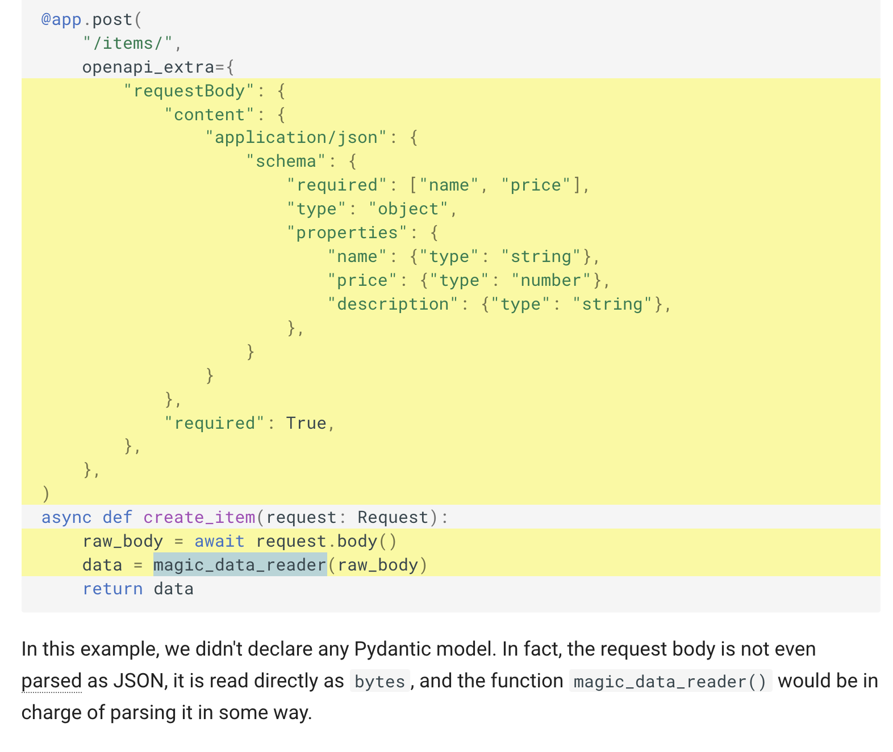

# 使用FastAPI搭建远程API接口
---
## 一、app代码结构
参考：https://github.com/nsidnev/fastapi-realworld-example-app
```python
app
├── api              - web related stuff.
│   ├── dependencies - dependencies for routes definition.
│   ├── errors       - definition of error handlers.
│   └── routes       - web routes.
├── core             - application configuration, startup events, logging.
├── db               - db related stuff.
│   ├── migrations   - manually written alembic migrations.
│   └── repositories - all crud stuff.
├── models           - pydantic models for this application.
│   ├── domain       - main models that are used almost everywhere.
│   └── schemas      - schemas for using in web routes.
├── resources        - strings that are used in web responses.
├── services         - logic that is not just crud related.
└── main.py          - FastAPI application creation and configuration.
```
---
## 二、FastAPI介绍
　FastAPI 是用于构建 Web API 的现代、开源、快速、高性能的 Web 框架，它基于Python 3.6+ 标准类型提示，支持异步，正如它的名字，FastAPI 就是为构建快速的 API 而生。
### 2.1 优点
自动类型检查。这意味着更少的 Bug，即使在深度嵌套的 JSON 请求中，Fast API 也会验证开发人员的数据类型。
集众所长，站在巨人的肩膀上。FastAPI 建立在 JSON Schema（用于验证JSON数据结构的工具），OAuth 2.0（用于授权的行业标准协议）和OpenAPI（这是可公开获得的应用程序编程接口）之类的标准之上。
现代化。FastAPI 使使用称为 graphene-python 的 Python 库轻松构建 GraphQL API 。
快速、高性能。可以和 NodeJS 和 Go 相提并论。
### 2.2 缺点
由于 FastAPI 相对较新，因此与其他框架相比，社区较小，第三方的教程相对较少。
### 2.3 用例
FastAPI 适用于构建高性能的 API，本身支持异步，如果要构建异步 API，可以优先选择 FastAPI。Netflix 将其用于内部危机管理。它还可以在部署准备就绪的机器学习模型时完美缩放，因为当 ML 模型封装在 REST API 并部署在微服务中时，它在生产中会发挥最佳作用。

---
## 三、代码编写
### 3.1 FastAPI准备之pydantic类型检查工具
- 官方文档: https://pydantic-docs.helpmanual.io/
- 这些组织都在用: Jupyter notebook ; FastAPI ; Amazon Web Services ; Uber ; Microsoft
- 优势: 可以和IDE结合, 可以读取环境变量, 对环境变量做一些检查, 对一些用Python做自动化运维的人来说是福音,比其他的类型检查库要快,可以校验复杂的数据结构(validator),集成到FastAPI框架中写起来会很优雅, Django的DRF也有自己的序列化框架,Golang的Gin框架同样也是.FastAPI和Gin一样优雅, 并且对扩展开放, 用户可以自定义校验规则
- 安装: `pip install pydantic`
- 参考文档：
    - https://blog.csdn.net/swinfans/article/details/89629641
    - https://blog.csdn.net/codename_cys/article/details/107675748
### 3.2 配置文件设置
#### 3.2.1 lru_cache的使用
不需要每次调用配置的时候，都得分别实例化一次配置。lru_cache的使用使得一次实例配置重新使用想通过的配置对象，而不是为每个请求都要重新实例化。
```python
@lru_cache
def get_app_settings() -> AppSettings:
    app_env = BaseAppSettings().app_env
    config = environments[app_env]
    return config()
```
- lru_cache 技术细节
    - @lru_cache() 修改它修饰的函数返回与第一次返回相同的值，而不是再次执行函数内部代码
    - 因此，它下面的函数将针对每个参数组合执行一次
    - 然后，每当使用完全相同的参数组合调用函数时，每个参数组合返回相同的值将一次又一次地使用
    - 在请求依赖项 get_settings() 的情况下，该函数没有参数，所以它总是返回相同的值
    - 这样，它的行为就好像它只是一个全局变量
    - 但是因为它使用了一个依赖函数，所以可以很容易地覆盖它进行测试
    - @lru_cache() 是 functools 的一部分，它是 Python 标准库的一部分
    - 使用 @lru_cache() 可以避免为每个请求一次又一次地读取 .env 文件，同时可以在测试期间覆盖它的
> lru_cache下面的函数将针对每个参数组合执行一次。然后，每当使用完全相同的参数组合调用函数时，这些参数组合中的每一个返回的值将一次又一次地使用。
- 官方文档：https://docs.python.org/zh-cn/3/library/functools.html#functools.lru_cache
- 参考文档：
    - https://www.shangmayuan.com/a/fa6e60fc84b6439581681362.html
    - https://blog.csdn.net/weixin_45154559/article/details/104581491
- 使用functools的@lru_cache而不指定maxsize参数:https://www.cnpython.com/qa/145717
#### 3.2.2 不同环境配置的调用
> 使用工厂设计模式完成搭建

#### 3.2.3 log日志
- Python 中更优雅的日志记录方案 loguru

    - 参考文档：https://cuiqingcai.com/7776.html
    
### 3.3 数据库
#### 异步操作数据库
- 参考文档：https://www.cnblogs.com/traditional/p/12290776.html

---
## 四、启动项目
uvicorn app.main:app --reload

---
## 五、项目部署
docker以及docker-compose的使用
- Dockerfile
- 启动容器：
`docker run -itd --name fastapi -p 8000:8000 -v $(pwd):/app -v $(pwd)/start-reload.sh:/start-reload.sh fapp /start-reload.sh
`

---
# 坑：
## docs文档无法加载
FastAPI 自动生成的docs文档没法使用, 这个是由于swagger-ui 3.30.1 中的bug导致

我们可以通过在FastAPI中指定低版本的swagger-ui 来解决这个问题，主要方法是在main.py的文件中加上如下代码：
```python
from fastapi import applications
from fastapi.openapi.docs import get_swagger_ui_html


def swagger_monkey_patch(*args, **kwargs):
    """
    Wrap the function which is generating the HTML for the /docs endpoint and 
    overwrite the default values for the swagger js and css.
    """
    return get_swagger_ui_html(
        *args, **kwargs,
        swagger_js_url="https://cdn.jsdelivr.net/npm/swagger-ui-dist@3.29/swagger-ui-bundle.js",
        swagger_css_url="https://cdn.jsdelivr.net/npm/swagger-ui-dist@3.29/swagger-ui.css")


# Actual monkey patch
applications.get_swagger_ui_html = swagger_monkey_patch


# Your normal code ...
app = FastAPI()
```
swagger cdn: https://www.bootcdn.cn/swagger-ui/

参考文档：
- https://blog.csdn.net/xiang__liu/article/details/80396642#commentBox
- https://blog.csdn.net/zhanggonglalala/article/details/98070986?utm_medium=distribute.pc_aggpage_search_result.none-task-blog-2~aggregatepage~first_rank_ecpm_v1~rank_v31_ecpm-2-98070986.pc_agg_new_rank&utm_term=fastapi%E6%96%87%E6%A1%A3swagger&spm=1000.2123.3001.4430
- https://blog.csdn.net/u014651560/article/details/116526653
- https://toutiao.io/posts/d1elomi

