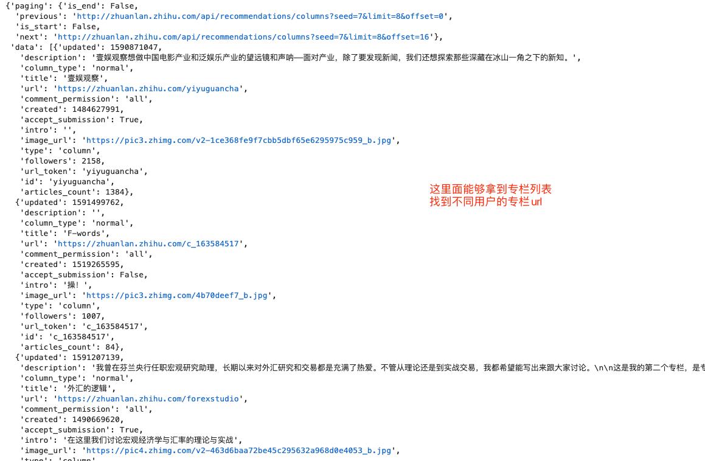
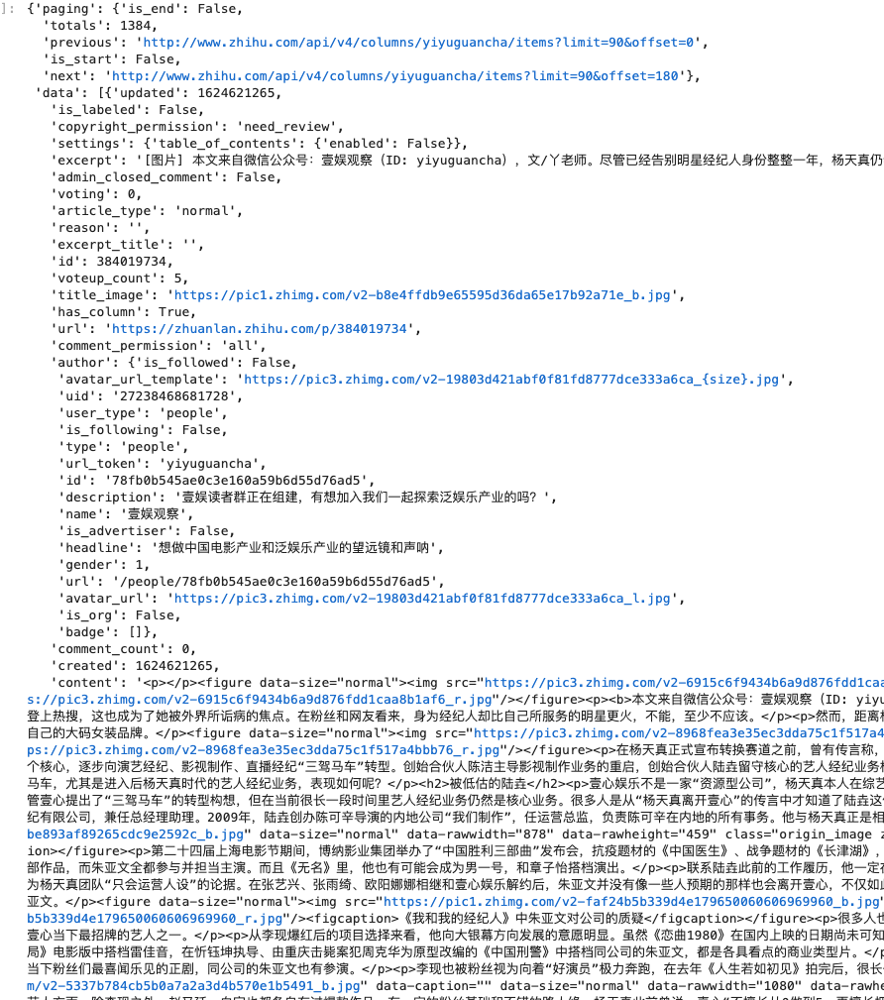

# 知乎文章爬虫

---
## 一、使用scrapy框架完成知乎爬虫的编写
### 1、scrapy项目搭建
- 实现流程：
    - 创建一个scrapy项目:scrapy startproject ZhiHuScrapy
    - 生成一个爬虫:scrapy genspider zhihu "zhihu.com"
    - 编写爬虫代码
    - 完善爬虫相应功能代码
---
### 2、项目爬虫配置
#### 2.1 设置ROBOT协议
```python
# False表示忽略网站的robots.txt协议，默认为True
ROBOTSTXT_OBEY = False
```

#### 2.2 设置User-Agent
```python
# scrapy发送的每一个请求的默认UA都是设置的这个User-Agent
USER_AGENT = 'Mozilla/5.0 (Macintosh; Intel Mac OS X 10_12_5) AppleWebKit/537.36 (KHTML, like Gecko) Chrome/59.0.3071.115 Safari/537.36'
```

#### 2.3 管道的使用, 完成数据的存储
- pipeline中常用的方法：
    - process_item(self,item,spider):实现对item数据的处理
    - open_spider(self, spider): 在爬虫开启的时候仅执行一次
    - close_spider(self, spider): 在爬虫关闭的时候仅执行一次
- 配置中开启管道：
```python
# Configure item pipelines
# See https://docs.scrapy.org/en/latest/topics/item-pipeline.html
ITEM_PIPELINES = {
   'ZhiHuScrapy.pipelines.ZhihuscrapyPipeline': 300,
}
```
- 使用mongodb存储数据，数据重复问题的解决方式
- 增加去重复pipeline 对数据进行去重的操作，配置中开启pipeline，设置好权重

#### 2.4 中间件的使用
- scrapy中间的作用
    - 主要功能是在爬虫运行过程中进行一些处理，如对非200响应的重试（重新构造Request对象yield给引擎）
    - 也可以对header以及cookie进行更换和处理
    - 其他根据业务需求实现响应的功能
- 开启中间件，增加user agent下载中间件
```python
# Enable or disable downloader middlewares
# See https://docs.scrapy.org/en/latest/topics/downloader-middleware.html
DOWNLOADER_MIDDLEWARES = {
    #    'ZhiHuScrapy.middlewares.ZhihuscrapyDownloaderMiddleware': 543,
    'ZhiHuScrapy.middlewares.UserAgentMiddleware': 443,
}
```

---
### 3、知乎爬虫编写
> 通过抓取知乎专栏的数据，再从中把所有专栏中的文章拿到

#### 3.1 抓包找到数据接口  想方设法拿到所有的专栏数据
- 需要控制limit  offset拿到相关数据
- 注意爬虫的限制
```python
zl_data_url = 'https://zhuanlan.zhihu.com/api/recommendations/columns?limit=8&offset=8&seed=7'
```
#### 3.2 上面接口返回数据


#### 3.3 进入专栏，爬文章列表数据；抓包找到对应的接口
```python
c_url = 'https://www.zhihu.com/api/v4/columns/yiyuguancha/items'
```
- 拿到对应专栏的文章数，设计爬取文章相应的方法
- 需要控制limit  offset拿到相关数据
- 注意爬虫的限制
#### 3.4 返回数据


---
### 4、item的使用
- Item能够做什么
    - 定义item即提前规划好哪些字段需要抓取，scrapy.Field()仅仅是提前占坑，通过item.py能够让别人清楚自己的爬虫是在抓取什么，同时定义好哪些字段是需要抓取的，没有定义的字段不能使用，防止手误
    - 在python大多数框架中，大多数框架都会自定义自己的数据类型(在python自带的数据结构基础上进行封装)，目的是增加功能，增加自定义异常
- 定义item
```python
class ZhihuscrapyItem(scrapy.Item):
    # define the fields for your item here like:
    # name = scrapy.Field()
    updated = scrapy.Field()  # 更新时间
    description = scrapy.Field()  # 描述
    column_type = scrapy.Field()  #
    title = scrapy.Field()  # 标题
    url = scrapy.Field()  # 专栏url
    comment_permission = scrapy.Field()  # comment_permission
    created = scrapy.Field()  # 创建时间
    accept_submission = scrapy.Field()  # accept_submission
    intro = scrapy.Field()  # intro
    image_url = scrapy.Field()  # 图片url
    type = scrapy.Field()  # type
    followers = scrapy.Field()  # 关注人数
    url_token = scrapy.Field()  # url_token
    id = scrapy.Field()  # id
    articles_count = scrapy.Field()  # 文章数
```
---
## 二、环境搭建以及项目启动
### 1、新建虚拟环境 安装相应的包
- 虚拟环境pip安装注意不同环境的切换问题
- 运行scrapy
```python
# 命令：在项目目录下执行
scrapy crawl <爬虫名字>
```

### 2、docker的使用
- 完成dockerfile的编写
```python
FROM python:3.7
WORKDIR /usr/src/app
COPY . /usr/src/app
RUN pip install -r requirements.txt -i https://pypi.tuna.tsinghua.edu.cn/simple
CMD ["python", "start.py"]
```
- 启动容器，开启爬虫
```bash
docker build -t zhihu .  # 生成镜像
docker run -d --name zh zhihu  # 后台启动容器进行爬虫
```